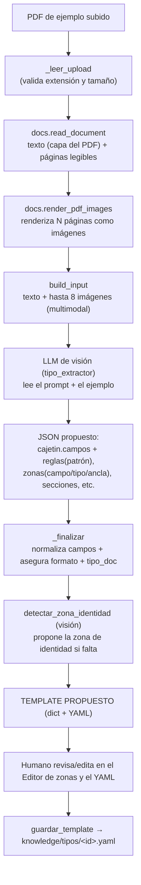
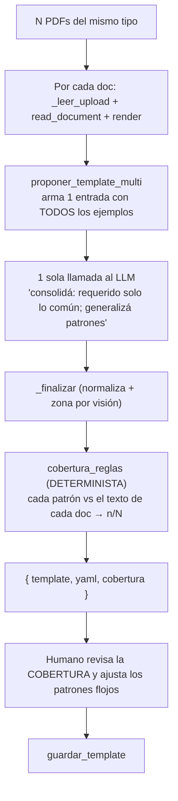
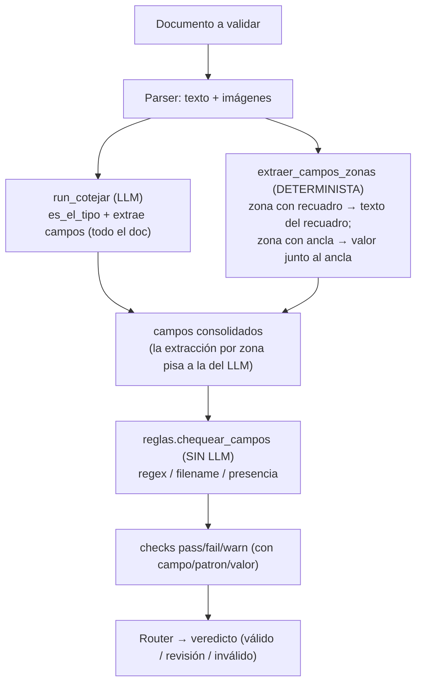
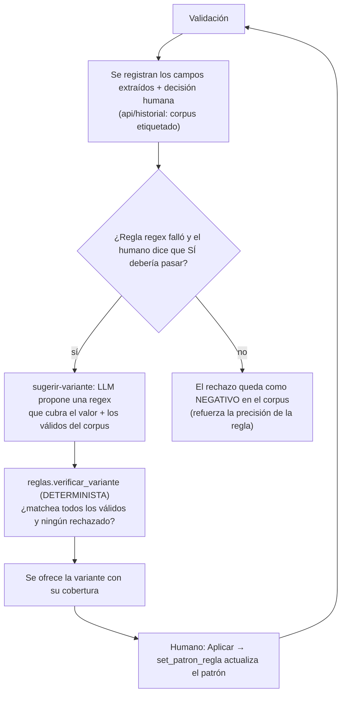

# Captura de reglas — flujo detallado

> Cómo se pasa de **un PDF** a un **template con reglas**, y cómo esas reglas se **usan** y **aprenden**.
> (Diagramas en Mermaid: se ven en GitHub o en VS Code con la preview de Markdown/Mermaid.)

## Idea central (la distinción que importa)

Hay **dos momentos de "extracción"** distintos y conviene no confundirlos:

| Momento | Quién | Qué hace | Resultado |
|---|---|---|---|
| **Captura** (definir el tipo) | LLM (visión) | Observa **uno o varios ejemplos** y propone **QUÉ** define al tipo: campos, patrones, zonas, secciones | el **template** (las reglas) |
| **Validación** (cotejar un doc) | LLM + motor | El LLM **extrae los VALORES** de esos campos de un doc nuevo; el motor los **valida sin LLM** | checks pass/fail + veredicto |

En la captura el LLM **propone las reglas**; en la validación **extrae los valores** y la decisión es **determinista**. El humano confirma en ambos lados.

---

## 1. Captura desde UN ejemplo (`POST /api/tipos/capturar`)



**Paso a paso:**
1. **`_leer_upload`** valida extensión (allowlist) y tamaño (`MAX_UPLOAD_MB`).
2. **`docs.read_document`** saca el **texto** (capa de texto del PDF) y marca si es legible.
3. **`docs.render_pdf_images`** renderiza las primeras páginas a imágenes PNG (hasta `SIM_MAX_PAGES`) — así el LLM **ve** el cajetín/encabezado/diagramas aunque haya texto.
4. **`build_input`** arma la entrada multimodal: el texto (truncado a ~12.000 chars) + hasta 8 imágenes.
5. **El LLM** (prompt `prompts/tipo_extractor.txt`) propone el template en JSON: `cajetin` (campos + `reglas` con patrón regex), `zonas` (con `campo`/`tipo`/`patron`/`ancla`), `secciones_requeridas`, `caracteristicas`, `bloqueante`, etc. El `modo` (`ejemplo` vs `especificacion`) cambia el *framing* del prompt.
6. **`_finalizar`** se queda solo con los campos conocidos, asegura que el formato del ejemplo esté en `formatos_archivo`, fija `tipo_doc`, y —si el LLM no marcó zona de identidad— llama a **`detectar_zona_identidad`** (otra pasada de visión) para proponerla (encabezado o rótulo, según el tipo).
7. Devuelve **template + YAML**. El humano lo refina (editor de zonas + YAML) y **guarda**.

> En la captura de UN ejemplo, los patrones que propone el LLM salen de mirar **ese** documento → pueden sobreajustarse. Por eso conviene la captura multi-doc (abajo).

---

## 2. Captura desde VARIOS ejemplos (`POST /api/tipos/capturar-multi`)



**Por qué es mejor:** con N ejemplos el LLM **generaliza** (no se pega a uno solo) y, sobre todo, la
**cobertura es determinista**: para cada regla con patrón, contamos en cuántos de los N documentos
matchea (`n/N`). Eso te dice de inmediato qué reglas son sólidas (`5/5`) y cuáles revisar (`3/5`, o
`0/5` si el patrón está mal — p. ej. una regex anclada con `^...$`).

**Forma de la cobertura:**
```json
[{ "campo": "codigo", "patron": "ECA-BRD-[0-9]+", "n": 5, "total": 5 },
 { "campo": "revision", "patron": "R[0-9]+", "n": 3, "total": 5 }]
```

---

## 3. Cómo se USAN las reglas al validar (extract-then-check)



Las **zonas con `campo`** extraen su valor de forma **determinista y acotada** (recuadro = posición
fija; ancla = sigue al texto), y **pisan** lo que el LLM extrajo. El LLM cubre los campos **sin**
zona. La validación (`chequear_campos`) es determinista: `regex` / `filename` / `presencia`.

---

## 4. Cómo APRENDEN las reglas (loop human-in-the-loop)



**Clave de seguridad:** la variante la **propone** el LLM pero la **verifica el motor** contra el
corpus antes de ofrecerla; **nada se auto-aplica**, el humano decide. El **score** tiene aparte su
propio loop automático (la auto-calibración de umbrales con cada doc promovido).

---

## 5. Dónde vive cada cosa

| Pieza | Archivo / función |
|---|---|
| Lectura + render del PDF | `tools/docs.py` → `read_document`, `render_pdf_images` |
| Prompt de captura | `prompts/tipo_extractor.txt` |
| Captura 1 ejemplo | `ai_agents/tipo_extractor.py` → `proponer_template` |
| Captura N ejemplos + cobertura | `ai_agents/tipo_extractor.py` → `proponer_template_multi`, `cobertura_reglas` |
| Normalización + zona por visión | `ai_agents/tipo_extractor.py` → `_finalizar`, `ai_agents/similarity.detectar_zona_identidad` |
| Reglas del template | `tools/tipos.py` → `reglas_de`, `zonas_identidad_de`, `set_patron_regla` |
| Extracción de valores (validación) | `ai_agents/triage.py` → `run_cotejar` (campo `campos`) |
| Validación determinista | `tools/reglas.py` → `chequear_campos` |
| Corpus etiquetado | `api/historial.py` → `registrar_validacion(campos=…)`, `corpus(tipo)` |
| Variante propuesta + verificada | `ai_agents/tipo_extractor.proponer_regex` + `tools/reglas.verificar_variante` |
| Endpoints | `api/main.py` → `/tipos/capturar`, `/tipos/capturar-multi`, `/tipos/{id}/reglas/sugerir-variante`, `/tipos/{id}/reglas/aplicar` |

## 6. Limitaciones honestas
- En la captura, los **patrones los propone el LLM**; la cobertura (determinista) te dice qué tan
  buenos son, pero la inducción "perfecta" del regex desde valores es un problema difícil — por eso
  el humano revisa/ajusta.
- **Extracción acotada a la zona** (implementado). Una zona-regla resuelve su valor en 3 capas:
  - **Región**: `bbox` (posición fija) **o** `ancla_inicio`(+`ancla_fin`) (posición variable: el valor
    se busca junto al ancla o ENTRE dos marcas).
  - **Refinamiento**: `patron` (regex) extrae el token preciso dentro de la región. Si el ancla es un
    prefijo del valor (ej. ancla `ECA-BRD` + patrón `ECA-BRD-[0-9]+`), el ancla ubica la línea y el
    patrón extrae el token completo.
  - **Modo** `comparar`: `texto` (extrae y valida el valor) o `visual` (recorta la región —**recuadro
    anclado**, que sigue verticalmente al ancla— y la **embebe** para comparar por imagen: logos/sellos).
  Todo determinista (PyMuPDF).
- **OCR como fuente de respaldo** (opcional, `OCR_PROVIDER=tesseract`, local): si un dato vive solo en
  la imagen (escaneo / texto rasterizado), la capa de texto no lo ve → se **OCR-ea** (la zona, o la
  página para ubicar el ancla). Cadena de extracción: **capa de texto → OCR → LLM**. Las dos primeras
  son deterministas. Si tesseract no está instalado, degrada al LLM (sin romper). También mejora la
  **captura** (el capturador recibe el texto OCR de ejemplos escaneados → mejores reglas + cobertura real).
- El corpus depende de que las **etiquetas humanas sean buenas**: una aprobación equivocada corre las
  reglas; mitigado porque todo cambio es sugerencia verificada + reversible + auditable.
