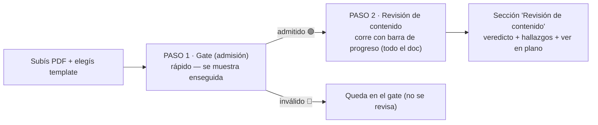

# Revisión de contenido — guía del flujo en la UI

> Cómo se ve y se usa la **revisión de contenido (Fase 1)** en la pantalla de Validar. Es el "segundo
> gate": una vez que un documento fue **admitido** (Fase 0), la revisión mira si el **contenido** es
> bueno y cumple la norma. Pensada para que un revisor entienda qué está viendo y decida con evidencia.

## Las dos preguntas (no confundirlas)

| Gate (Fase 0) | Revisión (Fase 1) |
|---|---|
| **¿Es lo que dice ser?** identidad + completitud | **¿El contenido es bueno y cumple?** calidad + norma |
| Veredicto: 🟢 válido · 🟡 revisión manual · 🔴 inválido | Veredicto: **aprobado · con notas · observado · rechazado** |
| Mira la **portada/cajetín** (rápido) | Mira **todo el documento** (más lento) |

Solo los documentos **admitidos** entran a revisión.

## El flujo en pantalla (dos pasos)

1. **Paso 1 — Gate.** Apenas subís el documento, corre la admisión (rápida, mira la portada) y **se
   muestra el veredicto de admisión**. Ya podés leerlo.
2. **Paso 2 — Revisión.** Si el documento fue **admitido**, automáticamente arranca la revisión de
   contenido **cubriendo todo el documento**, con una **barra de progreso** ("Revisando el contenido…").
   No bloquea: seguís leyendo el gate mientras corre. Al terminar aparece la sección de revisión.

> **Toggle.** El checkbox *"Revisar contenido al admitir"* controla el paso 2. Si lo **destildás**, el
> documento queda admitido y la revisión no corre; aparece un botón **"Revisar contenido ahora"** para
> dispararla cuando quieras. (Para casos en *revisión manual* ámbar, la revisión arranca cuando un humano
> **aprueba** la admisión.)

## La sección "Revisión de contenido"

Aparece debajo del veredicto de admisión, con tres partes:

**1. Banner del veredicto de revisión** — uno de:

| Veredicto | Significado |
|---|---|
| 🟢 **Aprobado** | sin hallazgos accionables |
| 🟢 **Aprobado con notas** | solo observaciones menores |
| 🟡 **Observado** | hay algo *mayor* que corregir |
| 🔴 **Rechazado** | hay un *bloqueante* |
| ⤴ **Pendiente senior** | escalado a revisión senior |

Si dice **"confiabilidad parcial"** es porque hubo checks **no verificables** (ver abajo): el dictamen
es incompleto y conviene una mirada humana.

**2. Hallazgos agrupados por dimensión** — *legibilidad · norma · contenido · consistencia*. Cada fila:

- **Ícono de estado**: ✓ cumple · ! a revisar · ✕ no cumple · **? no verificable**.
- **Severidad**: `bloqueante` (rojo) · `mayor` (ámbar) · `menor` (gris) · `observacion` (azul).
- **Chip de norma** (ej. `AEA 90364`): de qué norma/código sale el chequeo (trazabilidad).
- **Evidencia** + **razonamiento** + **sugerencia** de corrección.

**3. "Ver en plano"** — abajo, el documento **multipágina** con los hallazgos **dibujados encima** de la
hoja donde ocurren, coloreados por estado. Navegás **todas** las páginas (no solo 6): cada hoja se pide
al vuelo (no viaja en la respuesta). Es la misma observabilidad del gate, ahora sobre el contenido:
**se ve dónde cumple y dónde no.**

## `no_verificable` — qué significa (importante)

El sistema **nunca inventa un "cumple"**. Si no puede medir algo, lo marca **no verificable**, por ejemplo:
- el **cuadro de cargas está dibujado** (no es una tabla real) → no se puede leer la columna;
- un **valor vive solo en la imagen** y no hay OCR;
- la hoja no se pudo renderizar.

Un `no_verificable` **no cuenta como fallo**, pero **baja la confianza** y empuja a que un humano lo mire.

## Resolver la revisión

Abajo de los hallazgos podés fijar el veredicto humano (con notas opcionales):
**Aprobar · Aprobar con notas · Enviar a corrección (observado) · Rechazar · Escalar a senior.**
La decisión queda registrada; el veredicto automático es una ayuda, **decide la persona**.

## De dónde sale el chequeo de norma (el vínculo)

El template del tipo **referencia** las normas que le aplican (`revision.normas: [aea-90364]`). Al revisar:
1. **Detecta** si el documento **declara** esa norma (busca sus marcas en el texto). *Declarar la norma
   esperada es en sí un check.*
2. **Aplica** las reglas de la norma; cada hallazgo **cita la norma** (`norma_ref`).

Las normas viven en `knowledge/normas/<id>.yaml` (reutilizables entre templates). Para sumar una norma o
ajustar umbrales, se edita ese YAML; para asociarla a un tipo, se agrega a `revision.normas` del template.
Detalle técnico en [ARCHITECTURE.md](ARCHITECTURE.md) y el spec
[SPEC_Cotejar_Fase1_Revision.md](spec/SPEC_Cotejar_Fase1_Revision.md).

## Probarlo

1. (una vez) Bajá documentos de ejemplo: `uv run python scripts/descargar_fixtures.py`.
2. En **Validar**, elegí el template **"Memoria de cálculo eléctrica"** y subí una memoria eléctrica.
3. Vas a ver el **gate** y, enseguida, la **revisión** con los checks de **AEA 90364** y dónde falla.
